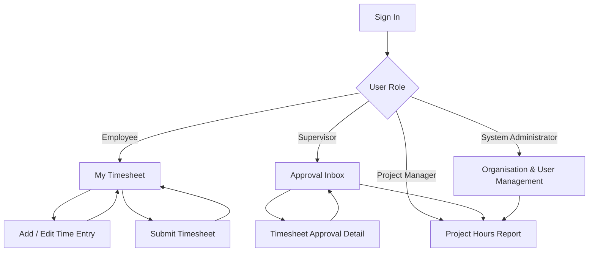
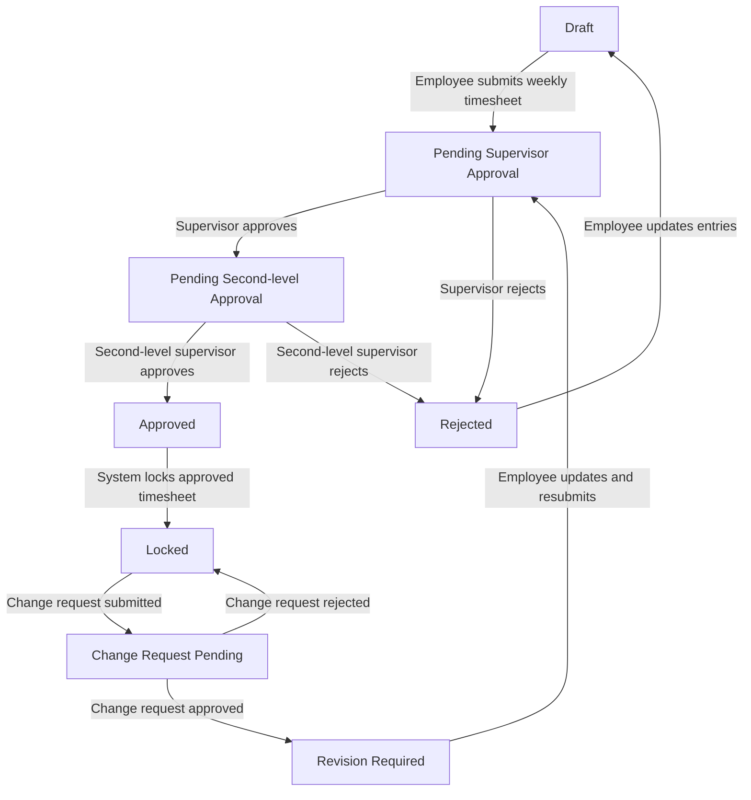

下面先给出一版 **Desktop-first、英文界面、适合港企内部系统** 的低保真原型方案。整体风格建议偏简洁、务实，类似企业内部 ERP 或 Jira 管理后台，不需要过度追求视觉效果。

日期在页面中统一使用 `DD/MM/YYYY`，数据库内部仍建议保存为标准 ISO 日期。英文用词尽量采用港企常见写法，例如使用 `Organisation` 而不是 `Organization`。

---

# 一、整体页面结构

建议第一版包含 8 个页面：

| 编号  | Page Name                      | 主要用途         | 使用角色        |
| --- | ------------------------------ | ------------ | ----------- |
| P01 | Sign In                        | 登录系统         | 所有人         |
| P02 | My Timesheet                   | 每周工时录入工作台    | 员工          |
| P03 | Add / Edit Time Entry          | 新增或编辑单条工时    | 员工          |
| P04 | Submit Timesheet               | 提交前检查和确认     | 员工          |
| P05 | Approval Inbox                 | 主管待审批列表      | 主管、二级主管     |
| P06 | Timesheet Approval Detail      | 审批工时明细       | 主管、二级主管     |
| P07 | Project Hours Report           | 项目工时报表       | 主管、项目经理、管理员 |
| P08 | Organisation & User Management | 组织架构、员工和权限管理 | 管理员         |

系统整体导航建议如下：

```text
┌─────────────────────────────────────────────────────────────┐
│ Company Logo   Timesheet Management System     🔔  Chris ▼ │
├────────────────┬────────────────────────────────────────────┤
│ Dashboard      │                                            │
│ My Timesheet   │              Main Content                  │
│ Approvals      │                                            │
│ Reports        │                                            │
│ Organisation   │                                            │
│ Administration │                                            │
└────────────────┴────────────────────────────────────────────┘
```

普通员工不显示 `Approvals`、`Organisation` 和 `Administration`。
主管显示 `Approvals` 和授权范围内的 `Reports`。
管理员显示全部菜单。

---

# 二、页面原型

## P01 — Sign In

这是最简单的入口页面。第一版使用公司邮箱和密码登录，后续可升级为公司 SSO。

```text
┌─────────────────────────────────────────────────────────────┐
│                                                             │
│                  Timesheet Management System                │
│                  Internal Staff Portal                      │
│                                                             │
│          ┌───────────────────────────────────────┐          │
│          │ Sign In                               │          │
│          │                                       │          │
│          │ Company Email                         │          │
│          │ [ chris@company.com                 ] │          │
│          │                                       │          │
│          │ Password                              │          │
│          │ [ •••••••••••••••                  ] │          │
│          │                                       │          │
│          │ [ ] Remember me                       │          │
│          │                                       │          │
│          │ [             Sign In              ]  │          │
│          │                                       │          │
│          │ Forgot password?                      │          │
│          └───────────────────────────────────────┘          │
│                                                             │
│          For internal use only                              │
└─────────────────────────────────────────────────────────────┘
```

### 交互说明

登录成功后，根据权限进入不同页面：

```text
Employee     → My Timesheet
Supervisor   → Approval Inbox
Admin        → Dashboard 或 Organisation
```

登录失败提示建议使用明确、简短的英文：

```text
Invalid email address or password.
Your account has been suspended. Please contact the administrator.
Please use your company email address.
```

---

## P02 — My Timesheet

这是员工使用频率最高的页面，也是整个系统的核心页面。

建议采用 **按周查看、按日录入** 的方式。员工每天填写工时，但最终按整周提交审批。

```text
┌─────────────────────────────────────────────────────────────────────────────┐
│ My Timesheet                                                               │
│ Record and submit your weekly working hours.                               │
├─────────────────────────────────────────────────────────────────────────────┤
│ [ ‹ Previous Week ]   01/06/2026 - 07/06/2026   [ Next Week › ]           │
│                                                                             │
│ Status:  Draft        Weekly Total: 38.5 / 40 Hours                         │
│                                                                             │
│ Mon 01 Jun   Tue 02 Jun   Wed 03 Jun   Thu 04 Jun   Fri 05 Jun   Weekend   │
│   8.0h          7.5h         8.0h          7.0h         8.0h        0.0h     │
│ [Selected]                                                                  │
├─────────────────────────────────────────────────────────────────────────────┤
│ Entries for Monday, 01/06/2026                         [ + Add Time Entry ] │
├─────────────────────────────────────────────────────────────────────────────┤
│ Project  │ Role       │ Work Type │ Task Nature │ Module  │ Ticket │ Hours  │
├──────────┼────────────┼───────────┼─────────────┼─────────┼────────┼────────┤
│ Core CRM │ Developer  │ Project   │ Development │ Billing │ CRM-21 │  4.0   │
│ Core CRM │ Developer  │ Project   │ Bug Fix     │ Billing │ CRM-35 │  2.5   │
│ Internal │ Developer  │ Internal  │ Meeting     │ General │   —    │  1.5   │
├─────────────────────────────────────────────────────────────────────────────┤
│ Total for selected day: 8.0 Hours                                          │
│                                                                             │
│ [ Copy Previous Day ]  [ Copy Selected Entry ]           [ Submit Week ]   │
└─────────────────────────────────────────────────────────────────────────────┘
```

### 页面重点

顶部周视图让员工快速发现缺失日期：

```text
0.0h     → 未填写
4.0h     → 工时不足，黄色提醒
8.0h     → 正常
10.0h    → 超出常规工时，黄色提醒
```

### 状态提示

当员工尚未提交时：

```text
Status: Draft
You can still add, edit or delete time entries.
```

已经提交后：

```text
Status: Pending Supervisor Approval
Your timesheet has been submitted. Editing is temporarily disabled.
```

被驳回后：

```text
Status: Rejected
Please review the supervisor's comments and resubmit your timesheet.
```

### 推荐快捷功能

第一版建议保留三个操作：

```text
+ Add Time Entry
Copy Previous Day
Copy Selected Entry
```

对于每天工作内容相似的员工，复制功能可以明显降低重复填写成本。

---

## P03 — Add / Edit Time Entry

建议使用右侧抽屉或居中弹框，不需要跳转到新页面。
这里单独列为一个原型，是因为它承载了 Jira 查询控件和主要业务字段。

```text
┌───────────────────────────────────────────────────────────────┐
│ Add Time Entry                                           ✕   │
├───────────────────────────────────────────────────────────────┤
│ Work Date *                                                   │
│ [ 04/06/2026 ▼ ]                                              │
│                                                               │
│ Project *                                                     │
│ [ Core CRM Project ▼ ]                                        │
│                                                               │
│ Role *                         Work Type *                     │
│ [ Developer ▼ ]                [ Project ▼ ]                  │
│                                                               │
│ Task Nature *                  Module *                        │
│ [ Bug Fix ▼ ]                  [ Billing ▼ ]                  │
│                                                               │
│ Jira Ticket                                                    │
│ [ Search by ticket number or keyword...                    ]   │
│                                                               │
│ Suggested Tickets                                              │
│ ┌───────────────────────────────────────────────────────────┐ │
│ │ CRM-1023   Payment API timeout                            │ │
│ │ Status: In Progress      Project: Core CRM                │ │
│ ├───────────────────────────────────────────────────────────┤ │
│ │ CRM-1038   Billing page UI issue                          │ │
│ │ Status: Open             Project: Core CRM                │ │
│ └───────────────────────────────────────────────────────────┘ │
│                                                               │
│ Selected Ticket                                               │
│ CRM-1023 — Payment API timeout                                │
│                                                               │
│ Hours *                                                       │
│ [ 2.5 ]                                                       │
│                                                               │
│ Description                                                   │
│ [ Investigated API timeout and added retry logic.          ]  │
│ [                                                           ] │
│                                                               │
│                                  [ Cancel ]  [ Save Entry ]   │
└───────────────────────────────────────────────────────────────┘
```

### Jira 查询控件交互

员工输入至少 2–3 个字符后才触发模糊查询：

```text
crm
CRM-10
payment
timeout
```

查询结果建议展示：

```text
Ticket Number
Ticket Summary
Ticket Status
Jira Project
```

员工选中后，系统保存：

```text
ticket_key
ticket_summary_snapshot
jira_project_key
jira_status_snapshot
```

### 字段校验规则

| 场景            | Jira Ticket | Description |
| ------------- | ----------- | ----------- |
| Development   | 必填          | 选填          |
| Bug Fix       | 必填          | 建议填写        |
| Testing       | 建议填写        | 选填          |
| Meeting       | 可为空         | 建议填写会议主题    |
| Internal Task | 可为空         | 建议填写        |
| Leave         | 可为空         | 建议填写        |

### Hours 校验

```text
Minimum: 0.25 hours
Maximum per entry: 24 hours
Maximum total per day: 24 hours
```

当单日超过 8 小时时，不直接阻止保存，只给提示：

```text
The total recorded hours for this day exceed 8 hours.
Please confirm that the entry is correct.
```

---

## P04 — Submit Timesheet

员工点击 `Submit Week` 后，进入提交前确认页面。
这个步骤很重要，可以减少主管收到不完整工时单的情况。

```text
┌─────────────────────────────────────────────────────────────────────────────┐
│ Submit Timesheet                                                           │
│ Review your weekly timesheet before submission.                            │
├─────────────────────────────────────────────────────────────────────────────┤
│ Employee: Chris Wong                                                       │
│ Department: Application Development                                       │
│ Period: 01/06/2026 - 07/06/2026                                           │
│                                                                             │
│ Weekly Total: 38.5 Hours                                                   │
├─────────────────────────────────────────────────────────────────────────────┤
│ Daily Summary                                                              │
├───────────────────┬───────────────┬─────────────────────────────────────────┤
│ Date              │ Total Hours   │ Validation                              │
├───────────────────┼───────────────┼─────────────────────────────────────────┤
│ Monday, 01 Jun    │ 8.0           │ ✓ Complete                              │
│ Tuesday, 02 Jun   │ 7.5           │ ⚠ Below standard working hours          │
│ Wednesday, 03 Jun │ 8.0           │ ✓ Complete                              │
│ Thursday, 04 Jun  │ 7.0           │ ⚠ Below standard working hours          │
│ Friday, 05 Jun    │ 8.0           │ ✓ Complete                              │
│ Weekend           │ 0.0           │ —                                       │
├─────────────────────────────────────────────────────────────────────────────┤
│ Approval Route                                                             │
│ Chris Wong → Mary Chan → David Lee                                         │
│ Employee       Supervisor    Second-level Supervisor                       │
│                                                                             │
│ Submission Note                                                            │
│ [ Optional note to your supervisor...                                   ]  │
│                                                                             │
│ [ Back to Edit ]                                   [ Submit for Approval ] │
└─────────────────────────────────────────────────────────────────────────────┘
```

### 提交前检查

建议系统自动执行以下检查：

```text
是否存在负数或 0 工时
是否存在单日超过 24 小时
是否存在必填但未填写的 Jira Ticket
是否存在未填写 Project 的记录
是否存在重复记录
是否存在未来日期
```

不足 8 小时只提醒，不阻止提交：

```text
Some working days contain fewer than 8 recorded hours.
You may still submit this timesheet.
```

---

## P05 — Approval Inbox

主管登录后，默认进入审批列表。

```text
┌─────────────────────────────────────────────────────────────────────────────┐
│ Approval Inbox                                                             │
│ Review and approve submitted timesheets.                                   │
├─────────────────────────────────────────────────────────────────────────────┤
│ [ Pending Approval 12 ] [ Approved ] [ Rejected ]                          │
│                                                                             │
│ Period [ 01/06/2026 - 07/06/2026 ▼ ]   Department [ All ▼ ]                │
│ Employee [ Search employee...          ]   [ Search ]                       │
├─────────────────────────────────────────────────────────────────────────────┤
│ ☐ │ Employee    │ Department      │ Period          │ Hours │ Submitted     │
├───┼─────────────┼─────────────────┼─────────────────┼───────┼───────────────┤
│ ☐ │ Chris Wong  │ App Development │ 01 Jun - 07 Jun │ 38.5  │ 08 Jun 09:20 │
│ ☐ │ Amy Lau     │ App Development │ 01 Jun - 07 Jun │ 40.0  │ 08 Jun 09:42 │
│ ☐ │ Jason Ho    │ QA Team         │ 01 Jun - 07 Jun │ 42.0  │ 08 Jun 10:15 │
├─────────────────────────────────────────────────────────────────────────────┤
│ Selected: 0                                                                │
│                                                                             │
│ [ Approve Selected ]                           [ Review Timesheet → ]       │
└─────────────────────────────────────────────────────────────────────────────┘
```

### 推荐交互

主管可以：

```text
查看单张工时单
批量通过
按部门筛选
按员工筛选
按周期筛选
查看已审批历史
查看已驳回记录
```

### 批量审批限制

批量操作只支持 `Approve Selected`。
驳回必须逐条打开，填写原因，避免误操作。

---

## P06 — Timesheet Approval Detail

主管点击某个员工的工时单后进入明细页。

```text
┌─────────────────────────────────────────────────────────────────────────────┐
│ Timesheet Approval Detail                                                  │
│                                                                             │
│ Employee: Chris Wong             Department: Application Development       │
│ Period: 01/06/2026 - 07/06/2026  Weekly Total: 38.5 Hours                  │
│ Status: Pending Supervisor Approval                                        │
├─────────────────────────────────────────────────────────────────────────────┤
│ Approval Progress                                                          │
│ ● Submitted        ● Supervisor Review        ○ Second-level Review         │
│ 08 Jun 09:20         Pending                    Not started                  │
├─────────────────────────────────────────────────────────────────────────────┤
│ ▾ Monday, 01/06/2026                                      Total: 8.0 Hours │
│                                                                             │
│ Project  │ Role      │ Work Type │ Task Nature │ Module  │ Ticket  │ Hours  │
│ Core CRM │ Developer │ Project   │ Development │ Billing │ CRM-21  │ 4.0    │
│ Core CRM │ Developer │ Project   │ Bug Fix     │ Billing │ CRM-35  │ 2.5    │
│ Internal │ Developer │ Internal  │ Meeting     │ General │ —       │ 1.5    │
├─────────────────────────────────────────────────────────────────────────────┤
│ ▸ Tuesday, 02/06/2026                                     Total: 7.5 Hours │
│ ▸ Wednesday, 03/06/2026                                   Total: 8.0 Hours │
│ ▸ Thursday, 04/06/2026                                    Total: 7.0 Hours │
│ ▸ Friday, 05/06/2026                                      Total: 8.0 Hours │
├─────────────────────────────────────────────────────────────────────────────┤
│ Employee Note                                                              │
│ Project support activity caused minor variation in daily hours.            │
│                                                                             │
│ Approval Comment                                                           │
│ [ Add a comment...                                                      ]  │
│                                                                             │
│ [ Reject Timesheet ]                                  [ Approve Timesheet ] │
└─────────────────────────────────────────────────────────────────────────────┘
```

### 驳回弹框

```text
┌─────────────────────────────────────────────────────┐
│ Reject Timesheet                                ✕  │
├─────────────────────────────────────────────────────┤
│ Please provide a reason for rejection.              │
│                                                     │
│ Rejection Reason *                                  │
│ [ Missing Jira ticket for the billing task.      ]  │
│ [ Please update the entry and resubmit.           ] │
│                                                     │
│                       [ Cancel ]  [ Confirm Reject ] │
└─────────────────────────────────────────────────────┘
```

### 审批原则

主管不直接修改员工数据，只能：

```text
Approve
Reject with comment
```

这样可以保证审计记录清楚，避免后续出现“谁修改了员工工时”的争议。

---

## P07 — Project Hours Report

这个页面给主管、项目经理和管理员查看正式工时统计。

默认只统计已经审批完成的数据。

```text
┌─────────────────────────────────────────────────────────────────────────────┐
│ Project Hours Report                                                       │
│ Analyse approved working hours by project, team and task category.         │
├─────────────────────────────────────────────────────────────────────────────┤
│ Date Range [ 01/06/2026 - 30/06/2026 ]                                    │
│ Project    [ All Projects ▼ ]     Department [ All Departments ▼ ]         │
│ Employee   [ All Employees ▼ ]    Module     [ All Modules ▼ ]             │
│ Work Type  [ All Types ▼ ]        Task Nature[ All Task Natures ▼ ]        │
│ Ticket No. [ Search Jira ticket... ]                                       │
│                                                                             │
│ [ Apply Filters ]  [ Reset ]                           [ Export Excel ]     │
├─────────────────────────────────────────────────────────────────────────────┤
│ Total Approved Hours   Project Hours   Internal Hours   Employees           │
│       1,248.5h             985.0h          263.5h           42              │
├─────────────────────────────────────────────────────────────────────────────┤
│ Hours by Project                                                           │
│                                                                             │
│ Core CRM Project              ██████████████████████  520.5h               │
│ Finance Portal                ██████████████          340.0h               │
│ Internal Support              ██████                  263.5h               │
│ Mobile App                    █████                   125.0h               │
├─────────────────────────────────────────────────────────────────────────────┤
│ Detailed Records                                                            │
├────────────┬────────────┬──────────────┬────────────┬────────┬─────────────┤
│ Employee   │ Date       │ Project      │ Module     │ Ticket │ Hours       │
├────────────┼────────────┼──────────────┼────────────┼────────┼─────────────┤
│ Chris Wong │ 04/06/2026 │ Core CRM     │ Billing    │ CRM-21 │ 4.0         │
│ Amy Lau    │ 04/06/2026 │ Finance      │ Payment    │ FIN-83 │ 3.5         │
└─────────────────────────────────────────────────────────────────────────────┘
```

### 报表建议

第一版保留三个层级：

```text
顶部：筛选条件
中部：汇总数字和简单图表
底部：可导出的明细表格
```

建议支持以下视角：

```text
By Project
By Department
By Employee
By Module
By Task Nature
By Jira Ticket
```

后续可以增加：

```text
Billable Hours
Non-billable Hours
Budget vs Actual
Employee Utilisation Rate
```

---

## P08 — Organisation & User Management

这个页面用于管理员维护组织关系和员工权限。

你之前提到是否使用展开组件。这里建议采用：

```text
左侧：Organisation Tree 展开组件
右侧：Employee Table
点击员工：右侧 Drawer 查看和编辑详情
```

不要把所有层级和员工全部堆在一个大型树形表格中。

```text
┌─────────────────────────────────────────────────────────────────────────────┐
│ Organisation & User Management                                             │
│ Manage organisation units, reporting lines and system access.              │
├───────────────────┬─────────────────────────────────────────────────────────┤
│ Organisation Tree │ Employees                                              │
│                   │                                                         │
│ ▾ PCCW Group      │ Department: Application Development                    │
│   ▾ Technology    │                                                         │
│     ▾ IT Delivery │ [ Search employee... ]      [ + Add Employee ]         │
│       ▾ App Dev   │                                                         │
│       ▸ QA Team   │ Name        │ Email              │ Supervisor │ Status │
│       ▸ Support   │ Chris Wong  │ chris@company.com  │ Mary Chan  │ Active │
│   ▸ Finance       │ Amy Lau     │ amy@company.com    │ Mary Chan  │ Active │
│   ▸ HR            │ Jason Ho    │ jason@company.com  │ David Lee  │ Active │
│                   │                                                         │
│                   │ [ Previous ]  Page 1 of 3  [ Next ]                     │
└───────────────────┴─────────────────────────────────────────────────────────┘
```

点击员工后，打开详情抽屉：

```text
┌───────────────────────────────────────────────────────────────┐
│ Employee Details                                         ✕   │
├───────────────────────────────────────────────────────────────┤
│ Full Name                                                     │
│ [ Chris Wong                                               ]  │
│                                                               │
│ Company Email                                                  │
│ [ chris@company.com                                        ]  │
│                                                               │
│ Organisation Unit                                              │
│ [ Application Development ▼ ]                                 │
│                                                               │
│ Direct Supervisor                                              │
│ [ Mary Chan ▼ ]                                               │
│                                                               │
│ Second-level Supervisor                                        │
│ [ David Lee ▼ ]                                               │
│                                                               │
│ System Roles                                                    │
│ [✓] Employee                                                   │
│ [ ] Supervisor                                                 │
│ [ ] Project Manager                                            │
│ [ ] Report Viewer                                              │
│ [ ] System Administrator                                       │
│                                                               │
│ Account Status                                                  │
│ [ Active ▼ ]                                                   │
│                                                               │
│                                  [ Cancel ]  [ Save Changes ]   │
└───────────────────────────────────────────────────────────────┘
```

### 页面建议增加三个 Tab

```text
Organisation Units
Employees
Approval Settings
```

`Approval Settings` 中可以配置：

```text
Default approval level: 2
Direct Supervisor Approval: Required
Second-level Supervisor Approval: Required
Allow delegation: Disabled in Phase 1
```

---

# 三、页面跳转关系图



---

# 四、工时单状态流转图

工时记录建议分为两个层级：

```text
Time Entry
单条每日工时明细

Timesheet
员工按周提交的一整张工时单
```

审批流以 `Timesheet` 为单位执行。



第一版 MVP 可以先简化为：

```text
Draft
  ↓
Pending Supervisor Approval
  ↓
Pending Second-level Approval
  ↓
Approved / Locked
```

任意审批节点都可以执行：

```text
Reject
  ↓
Employee Updates
  ↓
Resubmit
```

`Change Request` 可以放在第二阶段实现。

---

# 五、状态与颜色建议

| Status                        | 页面颜色建议 | 含义          |
| ----------------------------- | ------ | ----------- |
| Draft                         | Grey   | 员工可以自由编辑    |
| Pending Supervisor Approval   | Amber  | 等待直属主管处理    |
| Pending Second-level Approval | Amber  | 等待二级主管处理    |
| Approved                      | Green  | 已审批完成       |
| Locked                        | Blue   | 已锁定，不能修改    |
| Rejected                      | Red    | 需要员工修改并重新提交 |
| Change Request Pending        | Purple | 已提交更正申请     |

按钮文案统一使用动作表达：

```text
Save Entry
Submit for Approval
Approve Timesheet
Reject Timesheet
Export Excel
Copy Previous Day
Copy Selected Entry
```

---

# 六、权限与页面可见性

| Page                           | Employee | Supervisor | Second-level Supervisor | Project Manager | Admin |
| ------------------------------ | -------: | ---------: | ----------------------: | --------------: | ----: |
| Sign In                        |        ✓ |          ✓ |                       ✓ |               ✓ |     ✓ |
| My Timesheet                   |        ✓ |          ✓ |                       ✓ |               ✓ |     ✓ |
| Add / Edit Time Entry          |        ✓ |          ✓ |                       ✓ |               ✓ |     ✓ |
| Submit Timesheet               |        ✓ |          ✓ |                       ✓ |               ✓ |     ✓ |
| Approval Inbox                 |        — |          ✓ |                       ✓ |              可选 |     ✓ |
| Timesheet Approval Detail      |        — |          ✓ |                       ✓ |              可选 |     ✓ |
| Project Hours Report           |      仅本人 |       授权团队 |                    授权组织 |            负责项目 |    全部 |
| Organisation & User Management |        — |          — |                       — |               — |     ✓ |

主管本身也属于员工，因此仍然需要录入自己的工时。

---

# 七、第一版原型的重点

先不要一次加入太多复杂能力。第一版页面需要重点验证四件事：

```text
员工填写一周工时是否方便
Jira Ticket 查询是否顺手
主管审批是否能快速看懂问题
报表筛选口径是否满足管理需求
```

